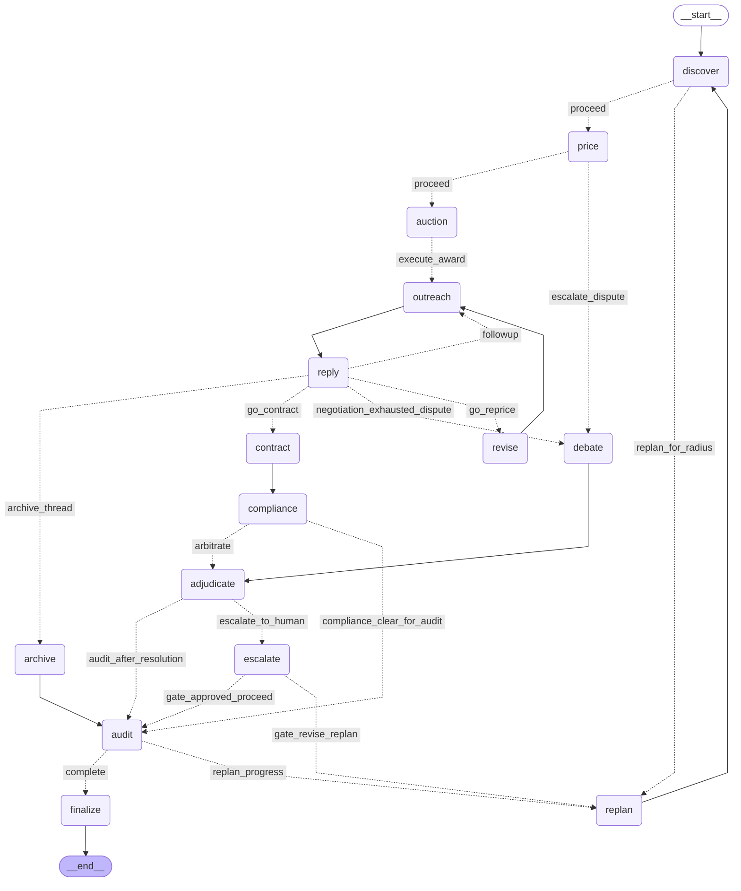

# Paytriq — design

## Architecture

Topology, from the module docstring in `graph/build.py:1-15`:

```
START -> discover --route_after_discovery--> [replan -> discover | price]
price --route_after_proposal--> [auction | debate -> adjudicate]
auction --route_after_auction--> outreach --(SEND gate)--> reply
reply --route_after_reply--> [contract | revise -> outreach | outreach | archive]
contract --(MOU gate)--> compliance --route_after_compliance--> [audit | adjudicate]
adjudicate --route_after_adjudication--> [audit | escalate --(ESCALATION gate)--> ...]
audit --route_progress--> [finalize | replan | finalize(give-up) | revise] -> END
```

The trailing `| revise` is the budgeted A6→A2 ROI critique (a
`revision_request` message counted against the replan/debate budget), not a
second pipeline — `finalize` remains the only route to `END`.

Two structural invariants: `finalize` is the only route to `END` (so the handoff
explaining the final routing decision always reaches state and trace — routers cannot
write state, they queue handoffs for the next node to drain via
`graph.edges.flush_handoffs`), and missing agents become logged no-op nodes rather
than absent ones (so the compiled topology never depends on who has finished coding).

The diagram below is not drawn by hand. It is the output of
`PaytriqGraph.mermaid()` (`graph/build.py:1613-1619`), i.e.
`compiled.get_graph().draw_mermaid()` called on the compiled object, so the published
diagram cannot drift from the topology that actually runs:



Rendered artefacts: `docs/architecture.mmd` is the source of truth (exact output
of `PaytriqGraph.mermaid()`); `docs/architecture.png` / `docs/architecture.svg`
are rendered from it and checked in so the diagram is viewable without a mermaid
toolchain. Regenerate with:

```bash
python -c "from graph.build import build_graph; print(build_graph().mermaid())" > docs/architecture.mmd
npx @mermaid-js/mermaid-cli -i docs/architecture.mmd -o docs/architecture.png
npx @mermaid-js/mermaid-cli -i docs/architecture.mmd -o docs/architecture.svg
```

(The currently checked-in PNG/SVG were rendered from the same `.mmd` topology
with matplotlib instead of `mmdc`, so no new dependency was required; prefer
`mmdc` when it is available.)

Conditional-edge wiring (labels → nodes) is declared once in `graph/edges.py`
`PATH_MAPS`; the fixed edges are `START → discover`, `replan → discover`,
`auction → outreach`, `outreach → reply`, `revise → outreach`, `archive → audit`,
`debate → adjudicate`, `contract → compliance`, `finalize → END`.

## Agent roles

`AgentId.ENVIRONMENT` is not an agent — it is the simulated sponsor counterparty
(`agents/environment.py`), part of the test environment. All seven reasoning agents
are `ReActAgent` subclasses discovered by `graph.registry` scanning (see
`agents/__init__.py` and `AGENT_MODULES`); every conditional judgement goes through
`ctx.decide`, never a raw model client or keyword match.

| Agent | Role | Inputs (board zones read) | Outputs (board zones written) | Tools | Decisions (all via `ctx.decide`) |
| --- | --- | --- | --- | --- | --- |
| A1 Discovery (`a1_discovery.py`) | Find candidate sponsors near the event and score fit | `event` zone (`EventProfile`) | `brands` zone (`BrandLead`, evidence-backed, never invented) | `search_brands` / `find_brands` / `search_places`; `geocode` / `geocode_place` / `nominatim_geocode` | search radius, recovery move after thin results, four fit components, accept/reject per lead; `sufficient=False` when too few survive so the graph widens the search |
| A2 Pricing (`a2_pricing.py`) | Price offers from footfall; revise honestly under pushback | `brands` (`BrandLead`) | `offers` (`Offer`, versioned; pitch included) | none directly — amounts come from a documented two-part tariff (delivery floor + per-attendee rate × tier multiplier), pitch from the text model when reachable | tier choice; on pushback, *posture* (hold / reduce / reduce-and-add / walk-away) then *concession band*; result clamped at the delivery floor with requested vs applied % both reported |
| A3 Outreach (`a3_outreach.py`) | Gated sending, reply classification, negotiation | `offers` (`Offer`); `threads` (`Thread`) | `threads` (`Thread`: draft → pending_approval → sent → replied / negotiating / closed) | `send_email` / `send_mail` / `email_send` (transport; `delivered=True` only on `status=OK`) | reply-intent classification as a closed `choice` over the `Intent` set (pushback checked before assent; `NEUTRAL` so unknown never defaults to interested); no send without an `Approval` row — otherwise `HumanGateRequired` and nothing is sent |
| A4 Contract (`a4_contract.py`) | Draft the MoU from terms actually accepted | `threads` with `intent=YES` / `closed_won` naming an `offer_id`; that `Offer` (newest revision) | `mous` (`MoU`: draft → pending_approval → approved) | `render_pdf` when registered (honest path recorded on degrade) | draftability/terms check; refuses to draft with `sufficient=False` when nothing accepted; release only on `GateOutcome.APPROVE` (MOU gate) |
| A5 Compliance (`a5_compliance.py`) | Verify deliverable commitments; holds veto authority | `mous` (`MoU`); evidence pages | `audit` zone (`AuditFinding`); `risk_flags` (`RiskFlag`, incl. `BLOCKING`) | `verify_evidence` (also tried as `evidence` / `browser` / `fetch` / `verify`); page *content* from the fetch tool — a URL is never evidence, and absence of evidence never counts as fulfilment | which phase to run; per-deliverable verdict; any `BLOCKING` flag is posted *before* raising `HumanGateRequired`, so the reason survives the park |
| A6 Audit (`a6_audit.py`) | Honest ROI plus the Reflexion lesson the next run reads | A5's `AuditFinding`s; `mous`; `event` | `roi` / `audit` zone (`ROIReport`, assumptions non-empty by schema validation); `lessons` (`Lesson` with board refs) | none — never recomputes compliance, reuses A5's findings (cross-checks a published `compliance_summary`, raising `COMPLIANCE_SUMMARY_MISMATCH` on disagreement) | conditional choices via `ctx.decide`; zero spend yields ROI `0.0` with an explicit "undefined" note, never a fabricated multiple |
| A7 Arbiter (`a7_arbiter.py`) | Conflict resolver; sole writer to `decisions` | `disputes` (`Dispute` with cited evidence, resolved verbatim onto the board) | `decisions` zone; `approvals` zone (`HumanGate` of kind `ESCALATION`); `lessons` | none — judgement only, positions weighed by cited board entries | `uphold_claimant` / `uphold_opponent` / `synthesis` (compromises built from numbers actually on the board); escalates below `confidence_threshold` or after `max_debate_rounds` via `ArbiterEscalation` → graph `interrupt()` |

A8 does not exist. There are exactly seven reasoning agents.

## Orchestration pattern

Five mechanisms compose, each owning one concern:

1. **LangGraph `StateGraph`** (`graph/build.py`, `graph/state.py`) — the pipeline
   above. Nodes run agents or coordination steps; routers return string labels mapped
   through `PATH_MAPS`. State (`PaytriqState`) is a *projection* of the blackboard
   (`collect_board_delta`); only agent-authored artefacts are projected, orchestration
   records are written directly so nothing is double-counted. A SQLite checkpointer
   persists every superstep, which is what makes parking resumable.
2. **Blackboard** (`blackboard/`, `core/schemas.py`) — the agents' only shared
   memory. Typed zones, single-writer discipline per zone, append-only history, and a
   derivation tree (`GET /api/runs/{run_id}/board/tree`) so any artefact cites its
   provenance.
3. **Contract-Net** (`graph/contract_net.py`, node `auction`) — A2 as manager
   announces the outreach task, eligible agents bid (`Bid`: feasibility, expected
   value, effort; award by `utility = value × feasibility / effort`), award recorded
   as a board event. No bids → the manager self-executes (Smith 1980), and the trace
   says which happened.
4. **Debate + arbitration** (`graph/debate.py`, nodes `debate`/`adjudicate`) —
   claimant and opponent author distinct `Dispute` positions with evidence refs;
   `run_debate` runs bounded rounds; A7 adjudicates (or synthesises) and unresolved
   disputes escalate. This is the `price → debate → adjudicate` branch.
5. **Magentic-One ledgers + interrupt gates** (`graph/state.py` `TaskLedger` /
   `ProgressLedger`, `graph/interrupts.py`) — `replan` rewrites the task ledger and
   widens the discovery radius through the fixed ladder `RADIUS_STEPS = (2.0, 4.0,
   8.0)`; `route_progress` judges complete / progressing / stalled and ends the run
   with a stated reason instead of looping into LangGraph's recursion limit. Three
   gates (`SEND`, `MOU`/`COUNTER`, `ESCALATION`) call `interrupt()`; every node
   follows flush → guarded agent run → build → interrupt → apply, with the agent run
   memoised (`StepMemo`) so resume never double-runs the agent above the gate.

## Tech justification

**Why LangGraph rather than CrewAI / AutoGen-style role chaining.** The topology has
conditional edges with budgets (replan budget, outreach touchpoint cap, negotiation
rounds), human interrupts that must resume on the same thread, and routers whose
decisions must be recorded as data. LangGraph gives all three natively: a compiled
`StateGraph` with `path_map` routing, a checkpointer-backed `interrupt()` with
`Command(resume=…)` semantics, and per-superstep state a test can assert on
(`tests/unit/test_graph.py` pins every intent→destination mapping and the stall
counter). A role-chaining framework would reimplement the router, the ledger, and
the parking — the parts most likely to be wrong.

**Why a blackboard rather than direct agent-to-agent calls.** Seven agents written
against frozen contracts cannot each know the other's interface; the board is the
frozen contract. It also buys the audit story for free: single-writer zones mean
every artefact has one provenance, append-only history means nothing is overwritten,
and the state projection means the graph can rewind, replay, and diff runs without
asking any agent to explain itself twice.

**Why `clef → gemini → rules`.** The decision layer (`decision/registry.py`) tries
the local calibrated decision model first (cheap, structured `noul` / `choice` /
`score` questions with probabilities), then Gemini structured output (for judgements
needing language understanding, e.g. intent classification), then deterministic rules
— and the fallback is *labelled*: the returned `Decision` carries
`source=RULES`/`REPLAY` with `degraded=True`, the handoff records it, and the
frontend renders it as `FALLBACK`, never as a model call. A degraded run is therefore
still an honest run, and `docs/EVALUATION.md §6` shows what the ablation looks like
when both models are down rather than hiding it.
